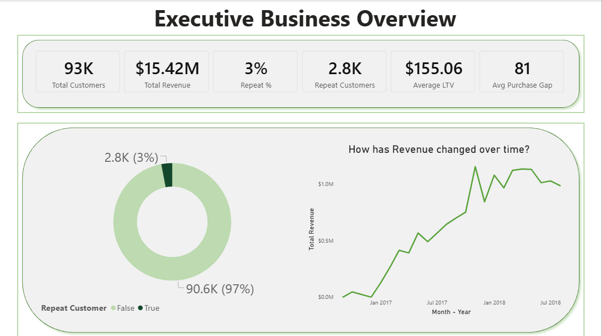
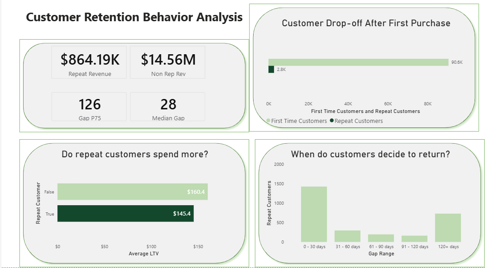
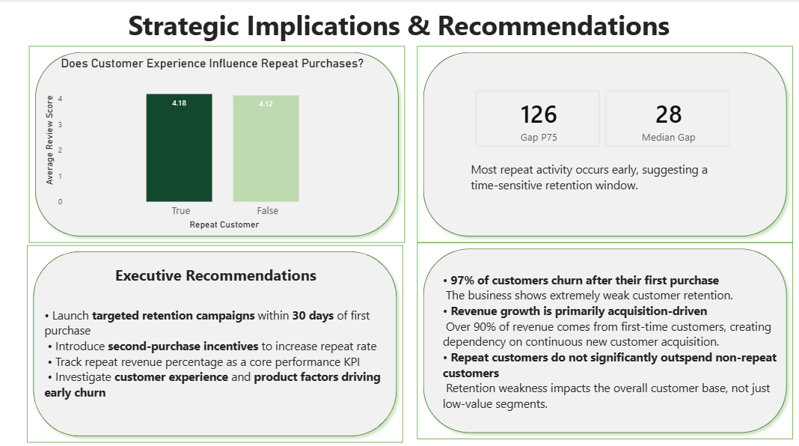

# 📊 Customer Retention Risk Analysis  
### End-to-End SQL + Power BI Data Analytics Project

---

## 🎥 Dashboard Demo

---

## 📌 Project Overview

This project analyzes customer retention performance using the Brazilian Olist e-commerce dataset.

Although the company generated **$15.4M in revenue from 93K customers**, only **~3% of customers made a repeat purchase**.

The analysis reveals that revenue growth is heavily dependent on continuous customer acquisition, exposing long-term sustainability risk.

This project demonstrates a complete analytics workflow:

**Raw Data → SQL Transformation → Data Modeling → Power BI Dashboard → Business Recommendations**

---

## 🎯 Business Objective

Evaluate whether the company’s growth model is sustainable and identify opportunities to improve second-purchase conversion.

Key questions addressed:

- How healthy is customer retention?
- Where do customers drop off?
- Do repeat customers generate significantly more value?
- When are customers most likely to return?
- Does customer experience (review score) influence repeat behavior?

---

## 🗂 Dataset

Source: Brazilian Olist E-commerce Dataset (publicly available)

Primary raw tables used:

- `orders`
- `order_items`
- `order_reviews`
- `customers`

---

# ⚙️ Data Pipeline

## 1️⃣ Data Exploration

Exploratory SQL queries were used to:

- Analyze order status distribution
- Filter delivered orders
- Identify repeat purchase frequency
- Validate review coverage

📂 View SQL file:  
👉 [01_data_exploration.sql](sql/01_data_exploration.sql)

---

## 2️⃣ Order-Level Aggregation

Created `order_summary` table:

- Aggregated total order cost (price + freight)
- Calculated average review score per order
- Filtered to delivered orders only
- Preserved purchase timestamp and customer linkage

📂 View SQL file:  
👉 [02_order_summary.sql](sql/02_order_summary.sql)

---

## 3️⃣ Customer-Level Aggregation

Created `customer_summary` table using window functions:

- Calculated Lifetime Value (LTV)
- Counted total orders per customer
- Identified first and second purchase timestamps
- Created repeat customer flag
- Computed gap between first and second purchase (days)

📂 View SQL file:  
👉 [03_customer_summary.sql](sql/03_customer_summary.sql)

---

# 📊 Power BI Dashboard

The aggregated tables were imported into Power BI to build a structured analytical model.

### Core Measures Created:

- Total Revenue  
- Total Customers  
- Repeat Customers  
- Repeat Rate (%)  
- Average LTV  
- Median & P75 Repurchase Gap  
- Revenue Split (Repeat vs Non-repeat)

📂 Download Power BI file:  
👉 [Customer_Retention_Dashboard.pbix](powerbi/Customer_Retention_Dashboard.pbix)

---

# 📈 Dashboard Structure

## 1️⃣ Executive Overview

- Revenue trend analysis  
- Customer volume metrics  
- Repeat rate identification  

---

## 2️⃣ Customer Behavior Analysis

- Drop-off after first purchase  
- LTV comparison (Repeat vs Non-repeat)  
- Repurchase timing distribution  

---

## 3️⃣ Strategic Implications

- Revenue dependency risk  
- Retention window identification  
- Review score impact analysis  
- Executive recommendations  

---

# 📈 Key Insights

- 97% of customers churn after their first purchase
- Revenue growth is primarily acquisition-driven
- Repeat customers do not significantly outspend non-repeat customers
- Review scores show minimal differentiation between repeat and churned customers
- Most repeat purchases occur within 30 days

---

# 🚨 Strategic Risk Identified

The company’s revenue model depends heavily on continuous customer acquisition.

If acquisition slows or becomes more expensive, revenue growth may plateau.

Improving second-purchase conversion is critical for long-term scalability.

---

# 📌 Recommendations

- Launch retention campaigns within 30 days post-purchase
- Introduce targeted second-purchase incentives
- Track repeat revenue percentage as a core KPI
- Investigate structural causes of early churn

---

# ▶️ How to Reproduce This Project

1. Download the Brazilian Olist dataset.
2. Execute SQL scripts in the following order:
   - `01_data_exploration.sql`
   - `02_order_summary.sql`
   - `03_customer_summary.sql`
3. Import generated tables into Power BI.
4. Open the provided `.pbix` file to explore the dashboard.

---

# 🛠 Tools & Skills Demonstrated

- SQL (CTEs, Aggregations, Window Functions)
- Data Transformation & Modeling
- Power BI Dashboard Development
- DAX Measure Creation
- Customer Lifecycle & Retention Analysis
- Business Problem Framing
- Insight Communication for Stakeholders

---

# 💼 Why This Project Matters

This project demonstrates the ability to:

- Work with raw relational datasets  
- Build structured SQL transformation pipelines  
- Translate KPIs into business risk  
- Design executive-ready dashboards  
- Move from analysis to actionable strategy  

---
